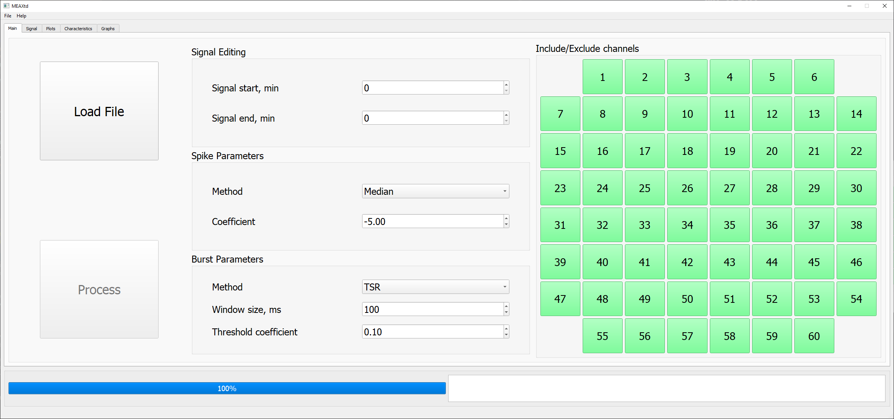
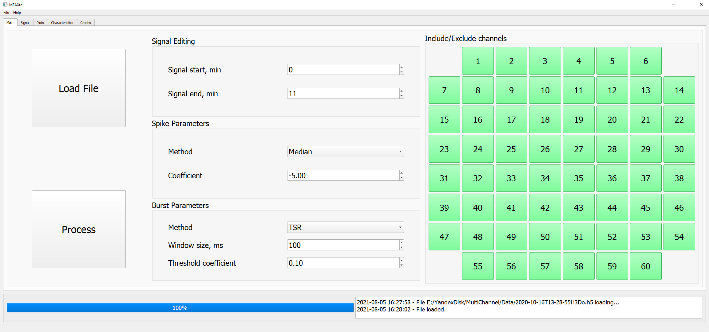
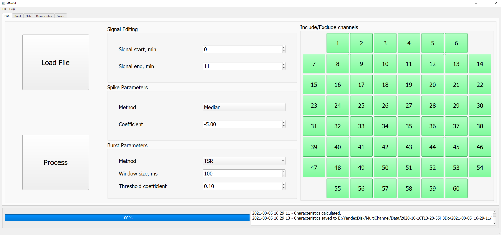
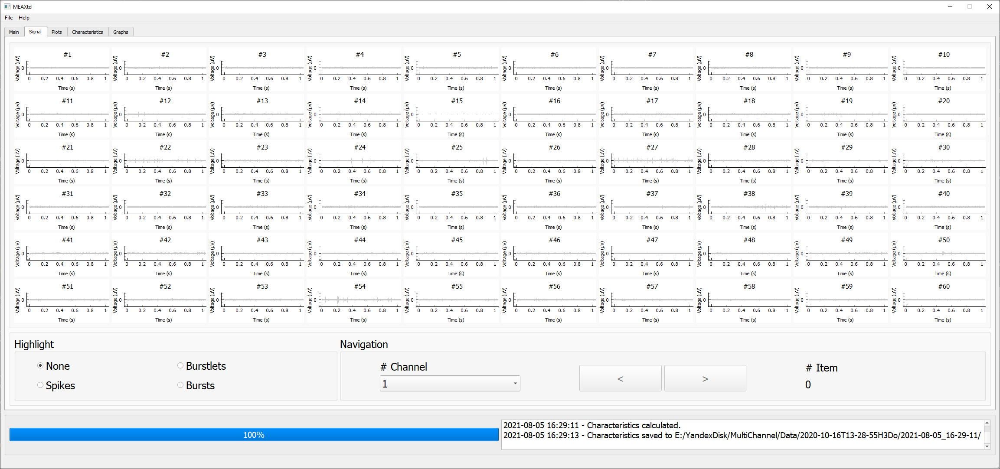

===============================
MEAXtd
===============================

.. image:: https://img.shields.io/travis/AaronBlare/MEAXtd.svg
        :target: https://travis-ci.com/AaronBlare/MEAXtd

MEA MultiChannel signal analysis

Файл \*.exe
-----------

Файл MEAXtd.exe с первой версией программы доступен по ссылке: https://github.com/AaronBlare/MEAXtd/releases/tag/v0.1

Его наобходимо скачать и запустить. Загрузка программы может занять несколько секунд.

Основной экран программы (вкладка Main)
-----------------------------------------

Главный экран программы выглядит следующим образом:

Программа работает **только** с файлами формата \*.h5. Для того, чтобы преобразовать файл \*.mcd или \*.msrd (для конвертации файла \*.msrd нужен также соответствующий файл \*.msrs) в файл \*.h5, можно воспользоваться конвертером:

https://www.multichannelsystems.com/software/multi-channel-datamanager

Кнопка "Load File" открывает файловую систему компьютера, в которой можно выбрать файл для загрузки.

После выбора файла он загружается в программу. По окончании загрузки файла в нижнем окне появляется соответствующее уведомление и становится активна кнопка "Process":

Кнопка "Process" запускает анализ загруженного файла: поиск спайков и берстов, вычисление характеристик, построение графиков. Статус анализа отображается в нижнем окне и в progress bar.

На главном экране можно изменять параметры поиска спайков и берстов.
На данный момент реализовано 3 метода поиска спайков: с использованием медианы, среднего квадратического или стандартного отклонения
::

    coeff * median(|x| \ 0.6745)
    coeff * RMS(x)
    coeff * std(x)

Задание метода осуществляется в панели "Spike Parameters". По умолчанию программа использует метод поиска медианы сигнала. Величина коэффициента (coeff) также может быть изменена в поле "Coefficient".

Далее программа на каждом канале осуществляет поиск берстлетов (последовательностей спайков) в окне, размер которого контролируется параметром "Window size" в панели "Burst parameters".

Берст регистрируется, если существует пересечение берстлетов на нескольких каналах (количество каналов регулируется параметром "Num channels").

При изменении параметров необходимо заново запускать анализ (Process).

Экран отображения сигналов (вкладка Signal)
------------------------------------------------

На вкладке Signal можно просматривать сигналы на всех каналах, а также подсвечивать найденные программой спайки, берстлеты и берсты.

В панели "Highlight" можно выбирать, какой тип данных необходимо выделить на экране - спайки, берстлеты или берсты.

В панели "Navigation" можно выбрать канал, на котором отображать найденные элементы (поле "# Channel"). Переход к предыдущему и/или следующему элементу осуществляется с помощью кнопок "<" и ">".

У всех элементов есть привязка к каналу. Если, например, берсты обнаружены только на каналах 1, 5 и 12, то на всех остальных каналах переход по берстам осуществляться не будет.

Все сигналы можно двигать с помощью мышки, изменять масштаб по осям X и Y. При наведении на график появляется кнопка "A" - нажатие по ней осуществляет автоматическое изменение масштаба (отрисовка стремится показать весь сигнал целиком), поэтому неосторожное её использование на вкладке Signal может привести к закрытию программы.

Экран отображения графиков (вкладка Plots)
------------------------------------------------

На вкладке Plots отображаются статистические графики, построенные при анализе загруженного файла.

.. image:: images\\plots_1.png

В левой верхней части окна отображается зависимость TSR (total spiking rate) от времени - суммарное количество спайков на всех каналах в окне 50 мс.

В нижней левой части окна отображается растровая диаграмма: точки соответствуют временам возникновения спайков на каждом из каналов.

В правой части отображаются диаграммы среднего времени активации и деактивации для берстов (среднее время первого спайка в берсте для каждого канала).

Экран отображения характеристик (вкладка Characteristics)
----------------------------------------------------------

На вкладке Characteristics отображаются вычисленные характеристики сигнала - глобальные, для каждого канала, для каждого берста, для каждой минуты.

.. image:: images\\characteristics_1.png

Все вычисленные характеристики также сохраняются в отдельные xlsx файлы. В папке, где находится оригинальный файл, создается отдельная папка с именем файла, в ней - папка с используемой конфигурацией параметров.
В эту же папку сохраняются все графики с вкладки Plots.

Обратная связь
---------------------

Для любой обратной связи используюся issues: https://github.com/AaronBlare/MEAXtd/issues

Здесь будет отображаться список уже открытых запросов. Прежде чем добавить новый запрос, необходимо проверить, не открыл ли кто-то такой же.

Если в программу нужно добавить новый функционал или есть предложение по модернизации программы, то используется шаблон "Feature request" (New issue -> Feature request -> Get started). Нужно дать заголовок, характеризующий новый функционал, и подробно описать запрос.

В случае обнаружения ошибки используется шаблон "Bug report" (New issue -> Bug report -> Get started). Нужно описать последовательность действий, которые привели к появлению ошибки. При необходимости, приложить скриншоты или ссылки на используемые файлы.

e-mail: kalyakulina.alena@gmail.com 